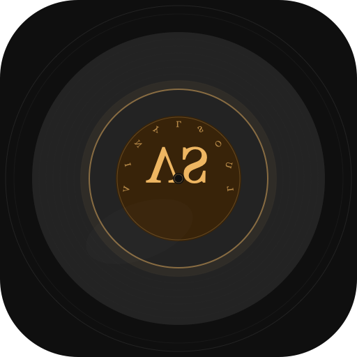

# VinylSoul — R&B 灵感唱片行 / R&B Inspiration Record Store

<p align="center">
  
</p>

<p align="center">
  <strong>输入心情，AI 为你生成专属 R&B 歌词与灵魂专辑</strong><br>
  <em>Input your mood. AI generates original R&B lyrics and a soul album.</em>
</p>

---

## ✨ 功能 / Features

- **情绪输入** — 滑动选择心情（忧伤/浪漫/洒脱），输入关键词，选择 R&B 风格标签
- **AI 创作** — DeepSeek API 生成原创歌词、虚拟专辑名、电台 DJ 独白、真实歌曲推荐
- **沉浸播放** — 旋转黑胶唱片动画、打字机逐字歌词、lo-fi 背景音乐、TTS 朗读电台独白
- **灵感唱片架** — SwiftData 持久化保存每次创作，随时回看或删除
- **🆕 触感反馈** — 生成时模拟唱片机启动震动，交互全程伴随细腻触感
- **🆕 每日灵感推送** — 每晚 8 点本地通知提醒「今天的 R&B 心情是什么？」，已打开则自动跳过
- **🆕 分享卡片** — 歌词+黑胶封面合成 1:1 图片，一键分享到 Instagram / 微信
- **🆕 MusicKit 集成** — Apple Music 曲库搜索，显示专辑封面，支持 30 秒预览播放
- **🆕 8 种 R&B 风格** — 90's Slow Jam、Neo-Soul、Alternative R&B、Contemporary R&B、PB R&B、Quiet Storm、New Jack Swing、Trap Soul
- **🆕 iPad 适配** — 创作页黑胶品牌双栏、统计页图表并排、播放页侧边唱片，全视图适配
- **🆕 添加到资料库** — 一键将推荐歌曲添加至 Apple Music 资料库
- **🆕 高质量 TTS** — 智能选择中文增强语音，自然语调朗读电台独白

---

- **Mood Input** — Slide to select mood (Sad/Romantic/Free), enter keywords, pick an R&B style
- **AI Generation** — DeepSeek API generates original lyrics, album title, DJ monologue, and real song recs
- **Immersive Playback** — Spinning vinyl animation, typewriter lyrics reveal, lo-fi beat, TTS DJ voice
- **Inspiration Shelf** — SwiftData-persisted history, tap to revisit, long-press to delete
- **🆕 Haptic Feedback** — Vinyl-startup haptics on generate, subtle feedback at every interaction point
- **🆕 Daily Inspiration Push** — 8 PM local notification reminder, smart skip if app already opened today
- **🆕 Share Card** — Composite album art + lyrics into 1:1 image, share via Instagram / WeChat / system sheet
- **🆕 MusicKit Integration** — Apple Music catalog search, album art display, 30s preview playback
- **🆕 8 R&B Style Tags** — 90's Slow Jam to Trap Soul, spanning classic to contemporary R&B
- **🆕 iPad Layout** — Dual-panel inspiration with vinyl branding, side-by-side stats charts, all 7 views adapted
- **🆕 Add to Library** — One-tap add recommended songs to Apple Music library
- **🆕 Premium TTS** — Auto-selects enhanced Chinese voice for natural-sounding DJ radio

---

## 📱 技术栈 / Tech Stack

| 层面 / Layer | 技术 / Technology |
|-------------|-------------------|
| UI | SwiftUI (iOS 18+) |
| 架构 / Architecture | MVVM + `@Observable` |
| 持久化 / Persistence | SwiftData |
| 网络 / Networking | URLSession + `actor` |
| 音频 / Audio | AVFoundation (AVAudioPlayer + AVSpeechSynthesizer) |
| 安全存储 / Secure Storage | Keychain (Security framework) |
| 通知 / Notifications | UserNotifications |
| AI | DeepSeek Chat API (`deepseek-chat`) |

---

## 🚀 快速开始 / Quick Start

### 前提 / Prerequisites

- macOS 15+ with Xcode 16+
- iOS 18.0+ deployment target
- [DeepSeek API Key](https://platform.deepseek.com/api_keys)

### 运行 / Run

```bash
# 1. Clone
git clone git@github.com:Kryst4lskyxx/VinylSoul.git
cd VinylSoul

# 2. Open in Xcode
open VinylSoul.xcodeproj

# 3. Add lofi-beat.mp3 to the project bundle (optional, app works without it)
#    Find a royalty-free loop at pixabay.com/music

# 4. Build & run (Cmd+R)
#    On first launch, tap the gear icon to enter your DeepSeek API key
```

### 测试 / Tests

```bash
# All tests
xcodebuild -project VinylSoul.xcodeproj -scheme VinylSoul test

# Unit tests only
xcodebuild -project VinylSoul.xcodeproj -scheme VinylSoul \
  -only-testing:VinylSoulTests test

# UI tests only
xcodebuild -project VinylSoul.xcodeproj -scheme VinylSoul \
  -only-testing:VinylSoulUITests test
```

---

## 🏗 架构 / Architecture

```
用户输入 / User Input
     │
     ▼
InspirationViewModel.generate()
     │
     ▼
DeepSeekService (actor) ──▶ DeepSeek Chat API
     │
     ▼
GenerationResult ──▶ AppStore ──▶ Tab 2 (正在播放 / Now Playing)
     │                              │
     ▼                              ├── SpinningVinyl (旋转唱片)
InspirationRecord (SwiftData)       ├── TypewriterText (逐字歌词)
     │                              ├── AudioManager (lo-fi + DJ TTS)
     ▼                              ├── MusicService (Apple Music 预览)
Tab 3 (唱片架 / Shelf)              ├── ShareCard (分享卡片)
                                    └── Haptics (触感反馈)

NotificationManager (每日 8PM 推送 / Daily 8PM Push)
```

---

## 📂 项目结构 / Project Structure

```
VinylSoul/
├── App/                    # @main entry, AppStore, Color extension
├── Models/                 # Codable value types (GenerationResult, Mood, StyleTag)
├── Services/               # DeepSeekService, AudioManager, KeychainManager
│                           #   MusicService, NotificationManager
├── ViewModels/             # @Observable classes per screen
├── Views/
│   ├── InspirationView     # Tab 1 — input form
│   ├── PlaybackView        # Tab 2 — vinyl + lyrics + DJ + recs
│   ├── HistoryView         # Tab 3 — past generations list + detail
│   ├── SettingsView        # API key sheet
│   └── Components/         # MoodSlider, StyleTagChip, SpinningVinyl,
│                           #   TypewriterText, HistoryCard, RecommendationRow,
│                           #   ShareCardView, ShareSheet
├── Persistence/            # InspirationRecord (@Model)
└── Assets/                 # vinyl.png, lofi-beat.mp3
```

---

## 🔑 环境变量 / Environment

| 变量 / Variable | 说明 / Description |
|----------------|-------------------|
| DeepSeek API Key | 在 App 设置页输入，存储至 Keychain / Enter in Settings, stored in Keychain |

无需 `.env` 文件或 plist 配置。 / No `.env` file or plist config needed.

---

## 📋 待办 / Roadmap

- [x] 触感反馈 / Haptic feedback
- [x] 每日灵感推送 / Daily inspiration push
- [x] 分享卡片 / Share card
- [x] MusicKit 集成 / MusicKit integration
- [x] 更多 R&B 风格标签 / More R&B style tags (3→8)
- [x] iPad 适配 / iPad layout adaptation
- [x] Apple Music 资料库添加 / Add to Apple Music library

---

## 📄 协议 / License

MIT
